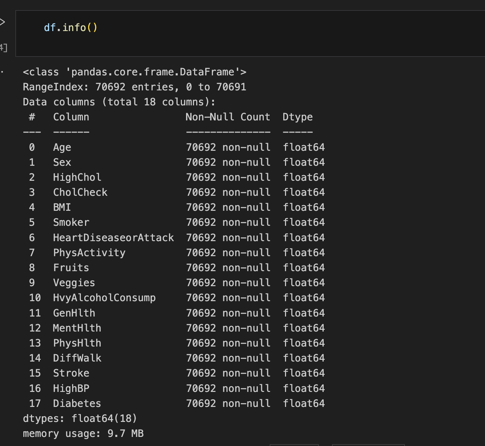
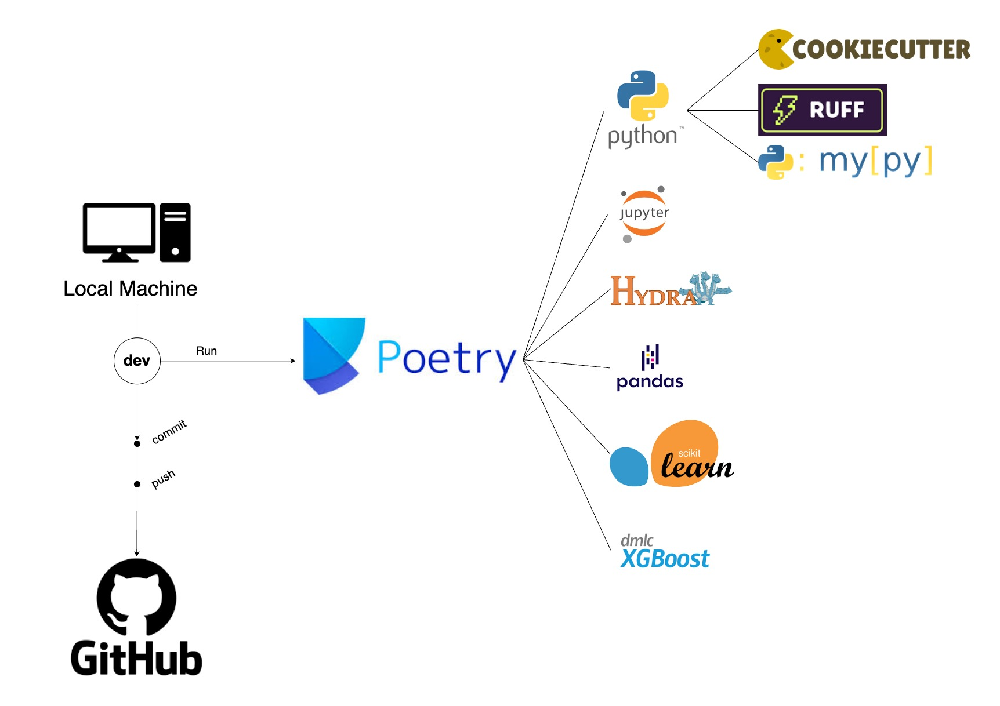

## Data Overview
The dataset titled "Diabetes, Hypertension and Stroke Prediction" on Kaggle, created by Prosper Chuks, is based on survey data from the Behavioral Risk Factor Surveillance System (BRFSS) for the year 2015. It includes 70,692 responses that have been cleaned for analysis. The data is structured to facilitate the prediction of diabetes, hypertension, and stroke using various health indicators. This dataset is particularly valuable for developing machine learning models aimed at predicting these conditions.

For more detailed information, you can view the dataset directly on Kaggle: https://www.kaggle.com/datasets/prosperchuks/health-dataset


## Setting Up Environment 
#### Using Poetry

The virtual environment for this project uses Poetry, which needs to be set up on your local machine.

```console
pip install poetry
```

When Poetry is set up, a `pyproject.toml` file and a `poetry.lock` file are created if it is the first time, however there is already a `.toml` file created inour case.
To create the virtual environment and corresponding packages for the project, you must install the dependencies and environment itself. We also want to keep our virtual environment
within the project itself. To do this, run the following two commands

```console
poetry config virtualenvs.in-project true
poetry install
```

This will create your `.venv` file, which is our virtual environment.

To run the code within the environment, run

```console
poetry shell
```

Now you can run the project within this environment.

If you want to add dependencies to the project, it is as simple as running

```console
poetry add <dependency>
```

Which will automatically add the dependency to the `pyproject.toml` file. 
Removing it is just as simple

```console
poetry remove <dependency>
```

To exit the virtual environment you can run 

```console
exit
```

This doesn't necessarily deactive the environment. To do this you must the following command within the shell.

```console
deactivate
```

## Data Preprocessing
We have python modules to prepare the data. The code contains two functions. The first function splits the data into training and testing sets. The second function normalizes the data. The data was very clean from Kaggle.

>[mlops_team_project/src/preprocess.py](../../mlops_team_project/src/preprocess.py)

These functions are called from the main entry point of the model 

>[mlops_team_project/models/xgboost_model.py](../../mlops_team_project/models/xgboost_model.py)

So when the model is invoked the steps will automatically run.

## EDA
We first started working with our model in Jupyter notebooks. You can start the notebook environment through make with

```
make run_jupyter
```

We didn't find any missing values or any non continuous numbers in our dataset to start. The dataset was pretty clean that we got from kaggle.

 

However we did need to normalize the data so we used the MinMax scaler from scikit learn. The dataset also needed to be split into training and testing - and we used the scikit learn train_test_split function for that. Once that was finished we started our baseline model and experiment models.

>[notebooks/1_modeling.ipynb](../../notebooks/1_modeling.ipynb)

We set up our modeling function so it could pickup hydra config when it runs in production through decorators and it also could be injected in notebooks with different experiments from hydra. This allows use maximum flexibility in the notebooks to iterate quickly.  

```python
# run xgboost with exp1 params
with initialize(version_base=None, config_path="../mlops_team_project/models/config"):
    hydra_params = compose(overrides=["+experiment=exp1"])
    print(hydra_params)

    model(
        X_train=X_train_normalized,
        X_test=X_test_normalized,
        y_train=y_train,
        y_test=y_test,
        hyperparameters=hydra_params.experiment,
    )
```

## Model
For our model we chose to use Gradient Boosting since we are predicting outcomes. Gradient Boosting is known to perform well on prediction tasks and allow for flexibitiy via different parameters.

Gradient boosting uses an ensemble technique - and typically it's creating multipe learners in the form of decision trees.  

As it iterates through the trees it's attempting to minimize errors and improve the accuracy.  

We used XGBoost as our framework to run this type of model.

## Steps to Replicate Training and Evaluation
When you run

```
make run_model
```

or

```
poetry run python mlops_team_project/models/xgboost_model.py
```

the model with split the dataset into train/testing sets and normalize. So preprocessing is automated through the entry point. We will optimize this in later tasks to only happen once when we start automatically chaining different tasks together.  

We are using Hydra for our hyperparameter tuning. We have a baseline configuration that runs without tuning any parameters and we have an experiment that tunes paramaters.  

>[mlops_team_project/models/config/default.yaml](../../mlops_team_project/models/config/default.yaml)  

When you want to run a new experiment you either change the value in the file above. If the experiment doesn't exist it first needs to be added to the experiments folder in `mlops_team_project/models/config/experiment`

We used Cross validation for our evaluation process with k folds = 5.  

We mainly our looking at accuracy scores to choose the best - model while making sure the model is not overfitting.  

Our baseline model outperformed out tuned model. Baseline had a 78%/74% split between train and test. This shows it didn't overfit and generalized well. However our tuned model had a split of 83%/73% so it was showing more overfitting and the testing accuracy went down slightly. So we would move forward with out basline model based on this evaluation.  

Evaluation results below.

Baseline Model  

  

Tuned Model 
  

## GitHub Actions

To enhance collaboration and cohesiveness of our coding standards in our distributed environment, three GitHub Actions were created. The most basic action simply automatically creates a Pull Request review email upon the opening of a new Pull Request, automatically sending the request to other teammates when it has been pushed, which ensures that the PRs do not miss being reviewed.

To establish cohesive coding standards and documentation standards, the two other GitHub actions implement Ruff, for styling, and MyPy for automated testing. The action for Ruff automatically checks all our code at PR opening and at every push, and if there is a need for reformatting, the action will automatically run ` fix ` according to our defined standards, and commit the fix accordingly. The MyPy action runs against all python code, scanning for any issues with formatting, typing, etc. and if any are detected, the PR will be unable to merge until these issues are remediated.

## What to improve on in future iterations
Right now when the model runs we are splitting up the full dataset into train/test and normalizing every time. We only need to do this once. However since we don't know how we are going to output our model and since these tasks run very quickly we decided to wait until we have more information in later phases to optimize this part of our code.

## Architectural Overview
  

### Contributions
Doc file containing detailed task and contribution
[Part 1](../project_1_tasks.txt)


