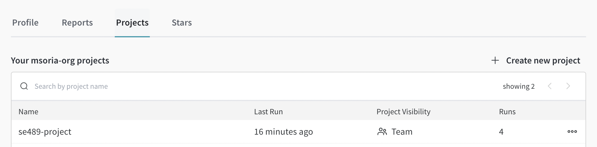
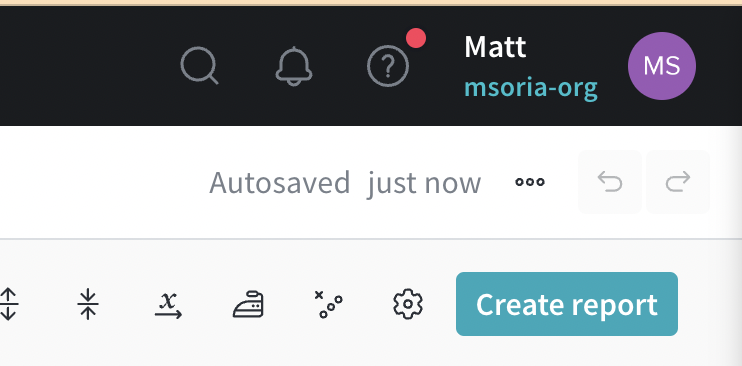
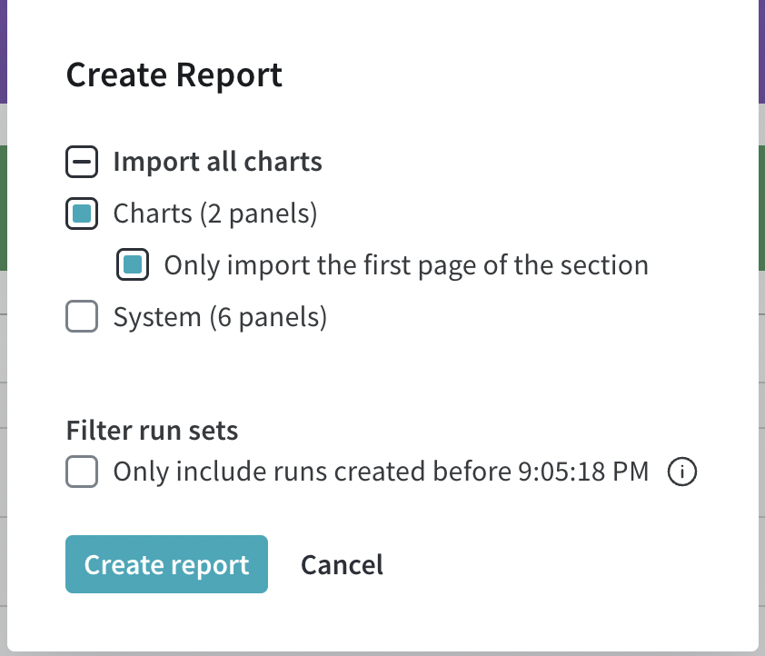
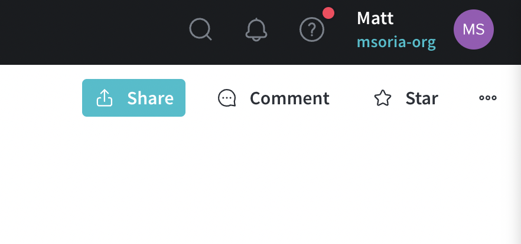
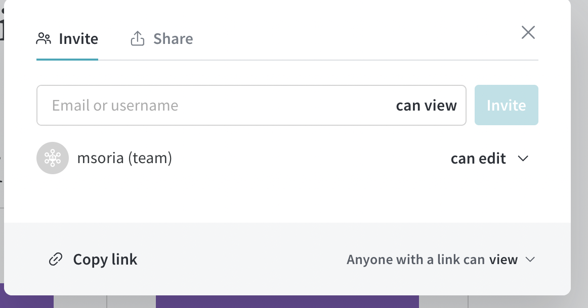
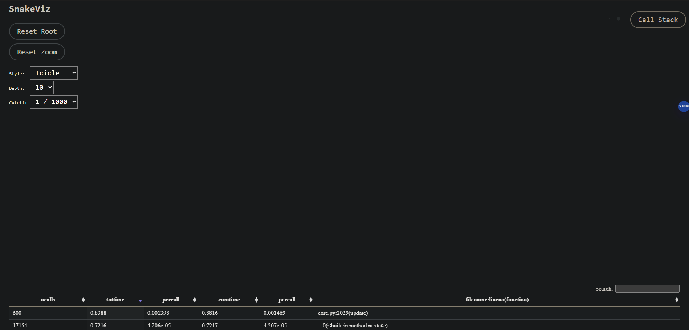
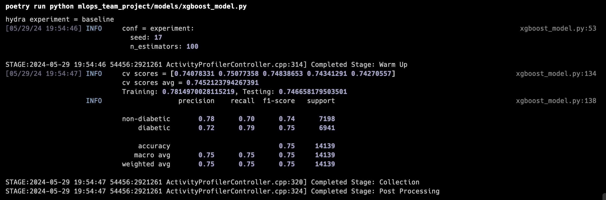
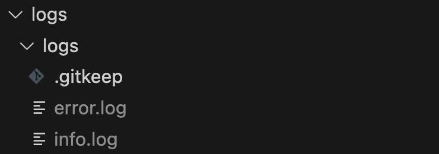
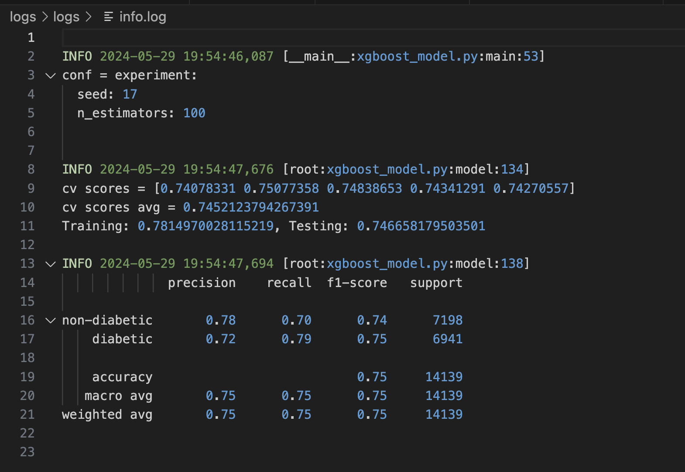

### Experiment Tracking
We are using Weights and Biases for experiment tracking. Our module has been reconfigured to pass in CLI arguments. When you want to run a experiment and have it tracked with Weights and Biases you pass in the `--wandb True` flag. By default it's False.  

First make sure you are logged into wandb and run the following:  

```
make wandb_login
```

Once you are logged in then you can run wandb with the model  

```
poetry run python mlops_team_project/models/xgboost_model.py --wandb True
```

### Configuration Management
We are using hydra to manage our experiment configuration. The configuration for the experiments can be found under  
>[mlops_team_project/models/config](../../mlops_team_project/models/config)  

The baseline config is under `baseline.yaml` and any experiments are under `exp1.yaml`, `expn.yaml`  

When you want to run a different config in the model pass `--hydra_experiment`. Example if I wanted to run the exp1.yaml file you would pass `--hydra_experiment exp1`

```
poetry run python mlops_team_project/models/xgboost_model.py --hydra_experiment exp1
```

In order to create a report once you've ran your weights and biases tracking you can go to the projects tab  

  

Next click on Create Report at the top right and click Create Report again on the pop up box

  
  

Next click on publish at the top right

  

Now your report has been created and published. However it still needs to be shared so click on Share at the top right and then change the link to be shared with anyone

 
 

Copy the link and share!
https://api.wandb.ai/links/msoria/u629g7n2

## Performance Profiling

We are able to profile our project's performance using three different tools: `cProfile` and `snakeviz` (used in tandem), and the `PyTorch profiler`.
Profile logs are found in the `profiling` directory.

### cProfile and Snakeviz
In order to use in our configuration, cProfile and snakeviz must be used together. To do this, one can run the model with cProfile, and output the result 
into a .prof file with the following command.
`poetry run python -m cProfile -o <output file>.prof -s <sort order> mlops_team_project/models/xgboost_model.py`

The `-s` flag refers to the sort order of the output. Included in the makefile are commands to run this with either `cumtime` or `tottime` as the sort order.
To run a different configuration, you must manually input the desired sort order and file output.

To visualize the outputs, we use snakeviz. To execute this visualization tool, run `snakeviz <file name>.prof`, which will provide a link in your terminal to
a visualization hosted on your locally.



### PyTorch Profiling

To profile our machine learning functions, we have implemented PyTorch to profile our function calls within the `xgboost_model.model()` function.
The visualization of this is done using tensorboard. To run tensorboard, you just have to run `make tensorboard` and this will open
the tensorboard visualizer for the project. The traces for tensorboard are found in `./logs/profiling/model_run`.


As of now, the profiling is set up to run per model run, so to do multiple iterations of training of the model for each run, there will need to be some refactoring.
For each model training, the PyTorch profiler must be stepped forward. Be sure to include `prof.step()` at the end of each iteration of the loop.

### Application Logging
We are using python's built in logging along with rich for formatting.
Info and Error logs can be found at `./logs/logs/`.

The configuration for the logging can be found here:
>[mlops_team_project/models/logging/logging.config](../../mlops_team_project/models/logging/logging.config)  

The logs are then instatiated as so:

```python3
def main(config: DictConfig, track_wandb: bool, wandb_project_name: str) -> None:
    """
    Main function that runs the necessary steps for modeling

    Args:
        config: hydra config which includes hyper parameters for xgboost
        track_wandb: boolean to determine if Weights and Biases is used
    """
    logging.config.fileConfig(Path(__file__).resolve().parent / "logging" / "logging.config")
    logger = logging.getLogger(__name__)
    logger.root.handlers[0] = RichHandler(markup=True)
```

Examples of the logging  
Console:  
  

Log Directory:  
  

Info.log:  
  

## Docker Containerization

This project is configured to run on docker. To get started, you just need to run the following two commands:

```console
docker build -t diabetes_predictor .

docker run -it --rm diabetes_predictor
```

This will build, then run the docker container. The provided run command will run the project as-is, as if you ran it with `poetry run python mlops_team_project/models/xgboost_model.py`, which by default includes logging, monitoring logs, and profiling logs. If you would like to configure your run such that the logs are exported onto your local machine, you may run docker with the following command:

```console
docker run -it --rm 
-v /desired/local/logs/directory:/app/logs/logs
-v /desired/local/performance/directory:/app/logs/profiling
diabetes_predictor
```
This command sets two volumes that get mapped to the app directories logs and performance within the docker container. Now, any file that gets placed in the `app/logs` or `app/performance` directories in docker, will then be copied over to the appropriate directory on your local machine.

[!NOTE]
The app directories MUST be `/app/logs/logs` and `app/logs/profiling` respectively, or the volumes will fail!

This application also includes additional commands that can be run to activate other features such as Weights and Balances. In order to do this, you must add the flags for those commands as if you are running them locally. For example:

```console
    docker run -it --rm `
    diabetes_predictor`
    --hydra_experiment <experiment name>
```

If you want to run Weights and Balances from docker, you must also define an environment variable `WANDB_API_KEY` in your docker run command. This will allow you to pass in your personal Weights and Balances API key when you run the program

```console
    docker run -it --rm `
    -e "WANDB_API_KEY=<your api key>" `
    diabetes_predictor`
    --hydra_experiment <experiment name>
```

## Common Debugging Gotcha's
To debug this application, we generally recommend using an IDE with a built in debugger such as PyCharm, Visual Studio, or utilizing the python debugger within Visual Studio Code. It is important to start debugging at the entrypoint of the application in the `main()` function in `xgboost_model.py`. Utilizing these debugging tools, you can set specific variables of the model as a 'watch' item, so you can keep track of how that value changes before and after training. 

[!NOTE]
A common issue when running a docker image with desired external log outputs came from the directories in which the logs are placed both within the docker container and in the local machine. To troubleshoot this, we recommend to first, ensure the paths that have been established are correct. Walk through the code and keep an eye out for the `LOG_DIR, LOGS_DIR, and PERF_DIR` variables, and how the logging code is executed in the `xgboost_model.py` file. In addition, it is recommended to launch the docker image with `docker run -it /bin/bash <docker image name or ID>`, which will then allow you to `exec` and navigate the file structure. This will allow you to identify the proper directory path you must identify for your volume or other path issues you may have.

## Monitoring
We are monitoring our model with logging in python. Are script logs the Cross Validation scores for each model and the classification report. The classification report includes precision and recall.  

```python3
    logging.info(
        f"cv scores = {cv_scores}\ncv scores avg = {cv_scores.mean()}\nTraining: {model.score(X_train, y_train)}, Testing: {model.score(X_test, y_test)}"
    )

    logging.info(
        classification_report(y_test, base_model_preds, target_names=target_names)
    )
```

These are the core metrics we want to observe in our model and they are printed to the console for the user as well as persisted to our log file.