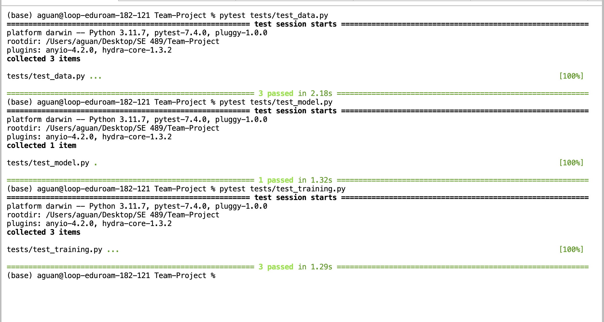

## FastApi
### Running Locally
FastApi is running in a docker container and here are the steps to build and run it locally  

[code](../../app/main.py)  
[docker](../../model-api.dockerfile)

```
docker build --platform linux/amd64 -t gcr.io/mlops489-425700/model-api:latest . -f model-api.dockerfile
```

```
docker run \
-p 8080:8080 \
-e PORT=8080 \
-v ~/.config/gcloud/application_default_credentials.json:/app/application_default_credentials.json \
-e GOOGLE_APPLICATION_CREDENTIALS="/app/application_default_credentials.json" \
gcr.io/mlops489-425700/model-api
```

```
curl -X POST "http://127.0.0.1:8080/predict/" -H "Content-Type: application/json" -d '{
    "data": "{\"age\": 6, \"sex\": 1, \"high_chol\": 1, \"chol_check\": 1, \"bmi\": 41.0, \"smoker\": 1, \"heart_disease\": 0, \"phys_activity\": 1, \"fruits\": 0, \"veggies\": 0, \"hvy_alcohol_consump\": 0, \"gen_hlth\": 4, \"ment_hlth\": 30, \"phys_hlth\": 15, \"diff_walk\": 1, \"stroke\": 0, \"high_bp\": 1}"
}'
```

## Model Training
### Running Locally
Our model runs in a docker container and this is how you can build and run it locally  

[code](../../mlops_team_project/models/xgboost_model.py)  
[docker](../../model-train.dockerfile)

```
docker build --platform linux/amd64 -t gcr.io/mlops489-425700/model-train:latest . -f model-train.dockerfile
```

```
docker run \
-v ~/.config/gcloud/application_default_credentials.json:/app/application_default_credentials.json \
-e GOOGLE_APPLICATION_CREDENTIALS="/app/application_default_credentials.json" \
gcr.io/mlops489-425700/model-train
```

## GCP
### Build and Deploy
We are using cloudbuild [link](../../cloudbuild.yml) to build and deploy our containers and applications.  
The following is done by cloudbuild:
- build our fastapi docker image
- build our model training docker image
- deploy our fastapi docker image to gcr
- deploy our model training docker image to gcr
- deploy our fastapi application to google cloud run
- deploy our api running on google cloud functions


### Images in Artifact Registry
 

### Running Training on a VM
Here are the steps and output how to create, run the model on a vm, and delete the vm  

#### Creating
Create the VM and install docker  
```
gcloud compute instances create model-train \
    --zone=us-central1-c \
    --machine-type=e2-medium \
    --network-interface=network-tier=PREMIUM,stack-type=IPV4_ONLY,subnet=default \
    --maintenance-policy=MIGRATE \
    --provisioning-model=STANDARD \
    --service-account=456644235286-compute@developer.gserviceaccount.com \
    --scopes=https://www.googleapis.com/auth/cloud-platform \
    --create-disk=auto-delete=yes,boot=yes,device-name=test,image=projects/debian-cloud/global/images/debian-12-bookworm-v20240515,mode=rw,size=20,type=projects/mlops489-425700/zones/us-central1-c/diskTypes/pd-balanced \
    --no-shielded-secure-boot \
    --shielded-vtpm \
    --shielded-integrity-monitoring \
    --labels=goog-ec-src=vm_add-gcloud \
    --reservation-affinity=any \
    --metadata=startup-script='#! /bin/bash
      sudo apt-get update
      sudo apt-get install -y docker.io
      sudo systemctl start docker
      sudo systemctl enable docker'
```

  

#### SSH
SSH into instance
```
gcloud compute ssh --zone "us-central1-c" "model-train" --project "mlops489-425700"
```


Configure Gcloud and Docker so we can pull the image from artifact registry  
```
sudo gcloud auth configure-docker
```


Pull training image
```
sudo docker pull gcr.io/mlops489-425700/model-train
```


Run training container
```
sudo docker run gcr.io/mlops489-425700/model-train
```


#### Deleting
Command to delete the vm once it's done being used  
```
gcloud compute instances delete model-train --zone=us-central1-c
```

#### Reading and Writing to Buckets
The model train has been updated to read and write to buckets

```python3
def read_from_google(file_name: str):
    bucket = client.get_bucket(BUCKET_NAME)
    blob = bucket.blob(file_name)
    return blob.download_as_bytes()

def save_model_to_google(model):
    bytes_for_pickle = io.BytesIO()
    pickle.dump(model, bytes_for_pickle)
    bytes_for_pickle.seek(0)

    bucket = client.get_bucket(BUCKET_NAME)

    blob = bucket.blob("models/xgboost_model.pkl")
    blob.upload_from_file(bytes_for_pickle, content_type="application/octet-stream")
```

### API on Google Cloud Functions
Cloud build deploys our api to google cloud functions [link](../../cloudbuild.yml)  
[code](../../cloud-function/main.py)

The functions reads the model saved to pkl in the training step from google bucket.

Here's an example curl request that passes data to return a prediction
```
curl -X POST "https://us-central1-mlops489-425700.cloudfunctions.net/model-api-function" -H "Content-Type: application/json" -d '{
    "data": "{\"age\": 6, \"sex\": 1, \"high_chol\": 1, \"chol_check\": 1, \"bmi\": 41.0, \"smoker\": 1, \"heart_disease\": 0, \"phys_activity\": 1, \"fruits\": 0, \"veggies\": 0, \"hvy_alcohol_consump\": 0, \"gen_hlth\": 4, \"ment_hlth\": 30, \"phys_hlth\": 15, \"diff_walk\": 1, \"stroke\": 0, \"high_bp\": 1}"
}'
```

  

In this example the prediction is non-diabetic


### FastAPI on Google Cloud run
Cloud build builds and deploys our fastapi to google cloud run [link](../../cloudbuild.yml)  

[code](../../app/main.py)  
[docker](../../model-api.dockerfile)  

Here's an example curl request that passes data to return a prediction
```
curl -X POST "https://model-api-cmi3zcjapa-uc.a.run.app/predict/" -H "Content-Type: application/json" -d '{
    "data": "{\"age\": 6, \"sex\": 1, \"high_chol\": 1, \"chol_check\": 1, \"bmi\": 41.0, \"smoker\": 1, \"heart_disease\": 0, \"phys_activity\": 1, \"fruits\": 0, \"veggies\": 0, \"hvy_alcohol_consump\": 0, \"gen_hlth\": 4, \"ment_hlth\": 30, \"phys_hlth\": 15, \"diff_walk\": 1, \"stroke\": 0, \"high_bp\": 1}"
}'
```

 

In this example the prediction is non-diabetic


## Unit Testing
 