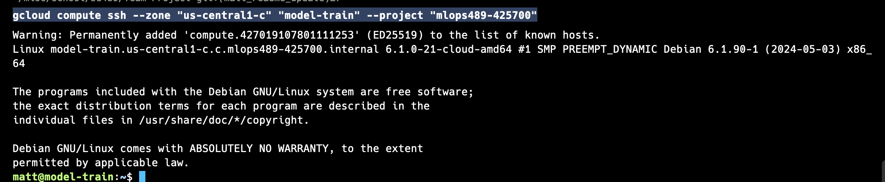

## FastApi
### Running Locally
FastApi is running in a docker container and here are the steps to build and run it locally  

[code](../../app/main.py)  
[docker](../../model-api.dockerfile)

```
docker build --platform linux/amd64 -t gcr.io/mlops489-425700/model-api:latest . -f model-api.dockerfile
```

```
docker run \
-p 8080:8080 \
-e PORT=8080 \
-v ~/.config/gcloud/application_default_credentials.json:/app/application_default_credentials.json \
-e GOOGLE_APPLICATION_CREDENTIALS="/app/application_default_credentials.json" \
gcr.io/mlops489-425700/model-api
```

```
curl -X POST "http://127.0.0.1:8080/predict/" -H "Content-Type: application/json" -d '{
    "data": "{\"age\": 6, \"sex\": 1, \"high_chol\": 1, \"chol_check\": 1, \"bmi\": 41.0, \"smoker\": 1, \"heart_disease\": 0, \"phys_activity\": 1, \"fruits\": 0, \"veggies\": 0, \"hvy_alcohol_consump\": 0, \"gen_hlth\": 4, \"ment_hlth\": 30, \"phys_hlth\": 15, \"diff_walk\": 1, \"stroke\": 0, \"high_bp\": 1}"
}'
```

## Model Training
### Running Locally
Our model runs in a docker container and this is how you can build and run it locally  

[code](../../mlops_team_project/models/xgboost_model.py)  
[docker](../../model-train.dockerfile)

```
docker build --platform linux/amd64 -t gcr.io/mlops489-425700/model-train:latest . -f model-train.dockerfile
```

```
docker run \
-v ~/.config/gcloud/application_default_credentials.json:/app/application_default_credentials.json \
-e GOOGLE_APPLICATION_CREDENTIALS="/app/application_default_credentials.json" \
gcr.io/mlops489-425700/model-train
```

## GCP
### Build and Deploy
We are using cloudbuild [link](../../cloudbuild.yml) to build and deploy our containers and applications.  
The following is done by cloudbuild:
- build our fastapi docker image
- build our model training docker image
- deploy our fastapi docker image to gcr
- deploy our model training docker image to gcr
- deploy our fastapi application to google cloud run
- deploy our api running on google cloud functions


### Images in Artifact Registry
 

### Running Training on a VM
Here are the steps and output how to create, run the model on a vm, and delete the vm  

#### Creating
Create the VM and install docker  
```
gcloud compute instances create model-train \
    --zone=us-central1-c \
    --machine-type=e2-medium \
    --network-interface=network-tier=PREMIUM,stack-type=IPV4_ONLY,subnet=default \
    --maintenance-policy=MIGRATE \
    --provisioning-model=STANDARD \
    --service-account=456644235286-compute@developer.gserviceaccount.com \
    --scopes=https://www.googleapis.com/auth/cloud-platform \
    --create-disk=auto-delete=yes,boot=yes,device-name=test,image=projects/debian-cloud/global/images/debian-12-bookworm-v20240515,mode=rw,size=20,type=projects/mlops489-425700/zones/us-central1-c/diskTypes/pd-balanced \
    --no-shielded-secure-boot \
    --shielded-vtpm \
    --shielded-integrity-monitoring \
    --labels=goog-ec-src=vm_add-gcloud \
    --reservation-affinity=any \
    --metadata=startup-script='#! /bin/bash
      sudo apt-get update
      sudo apt-get install -y docker.io
      sudo systemctl start docker
      sudo systemctl enable docker'
```

  

#### SSH
SSH into instance
```
gcloud compute ssh --zone "us-central1-c" "model-train" --project "mlops489-425700"
```



Configure Gcloud and Docker so we can pull the image from artifact registry  
```
sudo gcloud auth configure-docker
```


Pull training image
```
sudo docker pull gcr.io/mlops489-425700/model-train
```


Run training container
```
sudo docker run gcr.io/mlops489-425700/model-train
```


#### Deleting
Command to delete the vm once it's done being used  
```
gcloud compute instances delete model-train --zone=us-central1-c
```

#### Reading and Writing to Buckets
The model train has been updated to read and write to buckets

```python3
def read_from_google(file_name: str):
    bucket = client.get_bucket(BUCKET_NAME)
    blob = bucket.blob(file_name)
    return blob.download_as_bytes()

def save_model_to_google(model):
    bytes_for_pickle = io.BytesIO()
    pickle.dump(model, bytes_for_pickle)
    bytes_for_pickle.seek(0)

    bucket = client.get_bucket(BUCKET_NAME)

    blob = bucket.blob("models/xgboost_model.pkl")
    blob.upload_from_file(bytes_for_pickle, content_type="application/octet-stream")
```

### API on Google Cloud Functions
Cloud build deploys our api to google cloud functions [link](../../cloudbuild.yml)  
[code](../../cloud-function/main.py)

The functions reads the model saved to pkl in the training step from google bucket.

Here's an example curl request that passes data to return a prediction
```
curl -X POST "https://us-central1-mlops489-425700.cloudfunctions.net/model-api-function" -H "Content-Type: application/json" -d '{
    "data": "{\"age\": 6, \"sex\": 1, \"high_chol\": 1, \"chol_check\": 1, \"bmi\": 41.0, \"smoker\": 1, \"heart_disease\": 0, \"phys_activity\": 1, \"fruits\": 0, \"veggies\": 0, \"hvy_alcohol_consump\": 0, \"gen_hlth\": 4, \"ment_hlth\": 30, \"phys_hlth\": 15, \"diff_walk\": 1, \"stroke\": 0, \"high_bp\": 1}"
}'
```

  

In this example the prediction is non-diabetic


### FastAPI on Google Cloud run
Cloud build builds and deploys our fastapi to google cloud run [link](../../cloudbuild.yml)  

[code](../../app/main.py)  
[docker](../../model-api.dockerfile)  

Here's an example curl request that passes data to return a prediction
```
curl -X POST "https://model-api-cmi3zcjapa-uc.a.run.app/predict/" -H "Content-Type: application/json" -d '{
    "data": "{\"age\": 6, \"sex\": 1, \"high_chol\": 1, \"chol_check\": 1, \"bmi\": 41.0, \"smoker\": 1, \"heart_disease\": 0, \"phys_activity\": 1, \"fruits\": 0, \"veggies\": 0, \"hvy_alcohol_consump\": 0, \"gen_hlth\": 4, \"ment_hlth\": 30, \"phys_hlth\": 15, \"diff_walk\": 1, \"stroke\": 0, \"high_bp\": 1}"
}'
```

 

In this example the prediction is non-diabetic


## CI/CD 

This projects implements a series of code checks and runners for our CI/CD pipeline through GitHub Actions

### cml

Runs our Continuous Machine Learning worker, more info can be found [here](#continuous-machine-learning)

### dvc_pull

To maintain updated local data for our project, we implement Data Version Control. To do this, we have a github action that runs on every pull_request and push to the Main branch.
This GitHub action communicates with our cloud data storage to pull updated data into our repository for local and limited deployed use.

### mypy_check

This GitHub action runs our MyPy testing against the environment (ignoring missing imports). If there are any violations to the project's mypy configuration, it will not allow merging of the branch.

### request_pr_review

Configured to automatically request PR reviews from available teammates. Will request from all that are not the creator of the branch. The configuration for this is found in `.github/auto_request_review.yml`

### ruff_lint

This GitHub action is a linter that runs ruff to identify any code style issues, and commits any necessary changes created by `ruff --fix`. This also runs black, which 
performs further code styling checks according to Pep 8 style guides.

### run_testing

The final GitHub Action runs our unit tests on every 'push' to the remote branch. This runs the entire test suite, and any errors will prevent the merging of this branch. These issues should have been picked up during pre-commit.

## Continuous Machine Learning

This project implements Continuous Machine Learning to keep track of any changes that may occur to our model over time. This takes shape through the `cml.yaml` GitHub action.
This action runs on every push and pull-request and starts by setting up our python environment, and utilizes the GitHub Marketplace Action created by Iterative.ai to set up our CML integration. This will then run our
`xgboost_model.py` file, reading local data, and at the end it will create a comment on the pull request that will include a confusion matrix and classification report created by the `sklearn.metrics` library.
The final output will look like the following:


Note that this will read from the local data on the project.

## Pre-Commit Hooks

To maintain consistency across individual contributors, we have implemented `pre-commit` to ensure coding standards are followed.
The hooks we chose are found within the root directory, in the `.pre-commit-config.yaml`.
Again, these are mostly done to enforce formatting rules across our project. We have set up the following hooks
* trailing-whitespace: This trims down the amount of whitespace at the end of the file, preventing the commit of a large amount of uneccessary empty space.
* end-of-file-fixer: At the same time, we do want to ensure our files ends with a new-line, and nothing else
* check-yaml: checks our yaml syntax, if any errors appear in our .yaml files, the entire file fails
* check-added-large-files: this allows us to ensure that our code is modular. At the time of writing, this ignores DVC
* isort: helps organize our imports in alphabetical order, making it easier to manage
* interrogate: this will fail if the added functions lack docstrings, which helps us enforce good in-code documentation
* PyTest: runs our unit tests on-commit

Note that Ruff and Black are not used in pre-commits. These have been implemented in the GitHub action `ruff_lint.yaml` as a final formatting move.

If you would like to further configure the pre-commit hooks, you must do so in the `.pre-commit-config.yaml` file. Each commit hook has further configuration
that you can find in the respective repository listed for each commit hook.

On a successful pre-commit, the output will look like the following:

On a failed pre-commit run, the output will look like the following:

Interrogate will, on a failure, display a chart that outlines the failed metrics:

## Unit Testing

Unit tests are found in the tests directory. The two main tests that we have are `test_model.py` and `test_data.py`.
These tests can be run manually from the root directory of the project by running `poetry run pytest tests`, or individually `poetry run pytest tests/<desired test>`

These tests are run automatically on push through the GitHub Action `run_testing.yaml` and on every commit through the pre-commit hook set up on this repository.

### test_model.py

This tests the scope of the model, mocking our XGBoost model and applying a set of dummy data to confirm that the resultant model has the correct shape
on the `assert mock_model.predict.return_value.shape == y_test.shape`, along with the mocked accuracy values.

### test_data.py

This tests the data processing capabilities of the project. We create a processed dataset through the functionality in our preprocess file, and assert the output against
the values defined in our test function. This test was defined to ensure that our pulled data is what we expect, utilizing the (hopefully) most updated data in our local storage
set by DVC.
